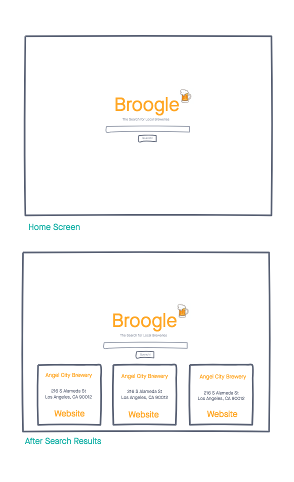

# Broogle

A web application that searches for breweries based on what city you are in using the GitHub Open Brewery DB.

## Technologies Used

- HTML5
- CSS3
- JavaScript
- jQuery
- Google Fonts
- Open Brewery DB

## Wireframe

## Getting Started

[Click Here](https://broogle.vercel.app/) to see the deployed app!

## Future Enhancements

- Allow the user to favorite and save breweries to local storage.